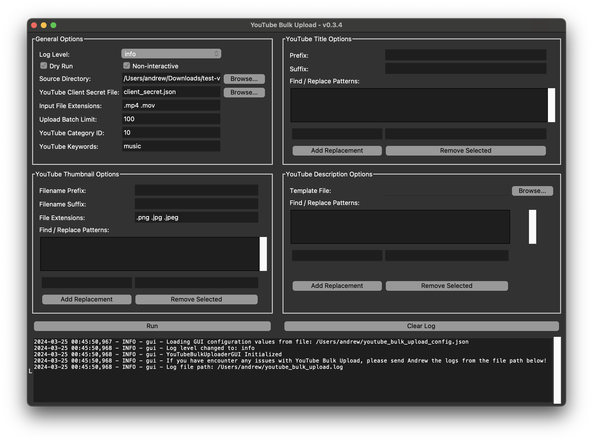
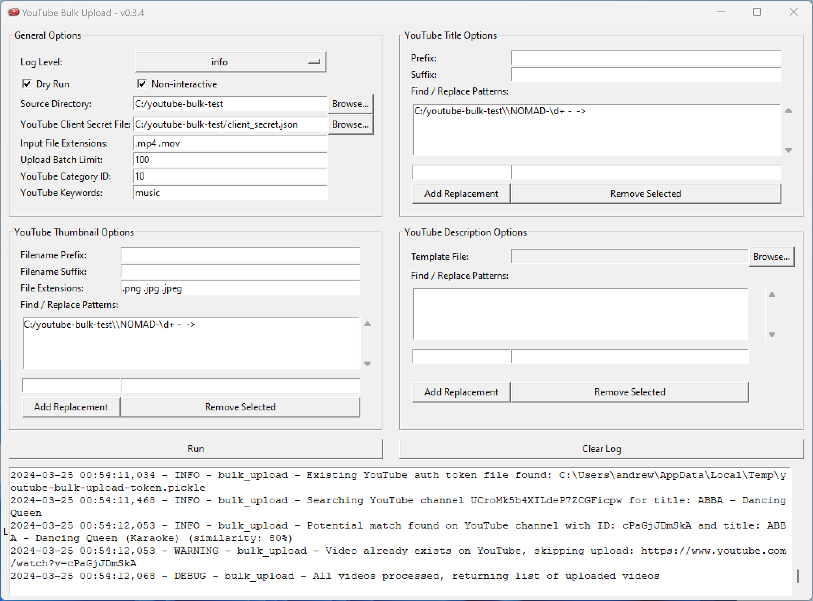

# YouTube Bulk Upload 🎥


**YouTube Bulk Upload** is a tool to facilitate the bulk uploading of video files to YouTube. This can be particularly useful for repopulating a channel after it has been unfairly terminated or when migrating content. The tool offers both a Command Line Interface (CLI) and a Graphical User Interface (GUI) to cater to different user preferences.


## Features
- Bulk upload videos to YouTube from a specified directory.
- Customize video metadata, including titles, descriptions, and keywords.
- Dry run mode to preview actions without making changes.
- Non-interactive mode for automated processes.
- Support for thumbnail customization.

## Installation (GUI)

YouTube Bulk Upload provides a Graphical User Interface (GUI) that can be launched from a stand-alone executable.

The GUI allows you to configure all the options available and use the tool through a (somewhat) user-friendly interface.

Download the executable (`.exe` or `.dmg`) for your operating system from the [Releases page](https://github.com/beveradb/youtube-bulk-upload/releases).

### Mac

Double-click the `.dmg` file to run the installer. Install the application by dragging the icon to your Applications folder:


Then run the application from your Applications folder as normal, it should look something like this:



### Windows

Double-click the `.exe` file to run the application - it doesn't need to be installed first.

Once it loads, it should look something like this:



## Creating a Client Secret for the YouTube Data API 

To use this tool, you'll need an OAuth 2.0 Client Secret (JSON file) with scopes enabled for the YouTube Data API.
This authenticates the app with Google's servers and allows you to interact with your own channel via the YouTube API.

YouTube provide [these instructions](https://developers.google.com/youtube/registering_an_application) for how to do this, but those instructions aren't very detailed.

Here are some more detailed instructions:

1) Log into the [Google Cloud Console](https://console.cloud.google.com) with your own Google Account

2) Create a [Google Cloud project](https://console.cloud.google.com/projectcreate), if you don't already have one

3) Enable the [YouTube Data API](https://console.cloud.google.com/apis/library/youtube.googleapis.com) 

4) Configure the [OAuth Consent Screen](https://console.cloud.google.com/apis/credentials/consent/edit) with minimal details for "your app", name (e.g. "My YouTube Bulk Uploader") and your email address 

5) On the Scopes tab, click `Add or Remove Scopes`, select the "Manage your YouTube account" scope (`.../auth/youtube`) and click Update 

6) On the `Test users`, just click `Save and Continue` - you shouldn't need to add any test users as long as it's just your own account you're using it with. Once you get past this screen, just click `Back to Dashboard`.

7) From the [API Credentials](https://console.cloud.google.com/apis/credentials) page, click `Create Credentials` then `OAuth client ID`. Set the application type to `Desktop app` and give it a name, e.g. `My YouTube Bulk Uploader` 

8) Once you see the `OAuth client created` screen, click `Download JSON` - this is the file you should specify in the "Client Secret File" setting in the YouTube Bulk Upload GUI/CLI. 

Here's a screencast video demonstration of me doing these steps:
<link to be added shortly>


## Usage (GUI))

👀 [Watch this tutorial video](https://youtu.be/9WklrdupZhg) for a better explanation and demonstration of how to use this tool.

YouTube Bulk Upload helps you upload videos to YouTube in bulk from a single folder, with custom metadata derived from the video file names.

Once you have a YouTube API client secret, you can point this tool at a directory of video files and it will upload them to YouTube, generating titles based on the filename, setting descriptions based on a template file, and optionally using a dedicated thumbnail image for each video in the same directory.

I highly recommend testing it out with "Dry Run" enabled first, in which mode it will log exactly what it is doing but won't actually upload anything.

Once you have confidence that your settings are correct and you're ready to execute it in bulk on a large number of files, tick the "Non-interactive" checkbox and it will no longer prompt you with popups asking for confirmation.

The find/replace patterns for video titles, thumbnail filenames, and YouTube descriptions all support regular expressions and empty replacement strings, or they can be left blank if you don't need to use them.

Hover over any element in the user interface for a tooltip popup explanation of that functionality.


## Installation (CLI)

To install YouTube Bulk Upload, ensure you have Python 3.9 or newer installed on your system. You can then install the tool using pip:

```bash
pip install youtube-bulk-upload
```

This command installs the latest version of YouTube Bulk Upload along with its dependencies.

## Usage (CLI)
The CLI offers a straightforward way to use YouTube Bulk Upload from your terminal or command prompt.

**Basic Usage**
To start a bulk upload with the default settings, navigate to the directory containing your video files and run:

```bash
youtube-bulk-upload
```

Refer to the CLI help for more options:

```bash
youtube-bulk-upload --help
```

## Integrating as a Package

You can also use YouTube Bulk Upload as a package in your own Python code. Here's a basic example of how to use it:

```bash
from youtube_bulk_upload.bulk_upload import YouTubeBulkUpload

uploader = YouTubeBulkUpload(
    source_directory="/path/to/videos",
    youtube_client_secrets_file="/path/to/client_secret.json",
    dry_run=True  # Set to False to perform actual uploads
)

uploaded_videos = uploader.process()
```

This script initializes the uploader with a source directory and a client secrets file, then starts the upload process in dry run mode.

All of the parameters available in the CLI (`youtube-bulk-upload --help`) are available in the `YouTubeBulkUpload` class.

For details, see the code in `youtube_bulk_upload/bulk_upload.py`.
For an example, see the CLI usage in `youtube_bulk_upload/cli.py`.

## License
YouTube Bulk Upload is released under the MIT License. See the LICENSE file for more details.

## Contributing
Contributions are welcome! Please feel free to submit pull requests or open issues on the GitHub repository.

## Acknowledgments
This project is maintained by Andrew Beveridge <andrew@beveridge.uk>.
Special thanks to all contributors and users for their support and feedback.

